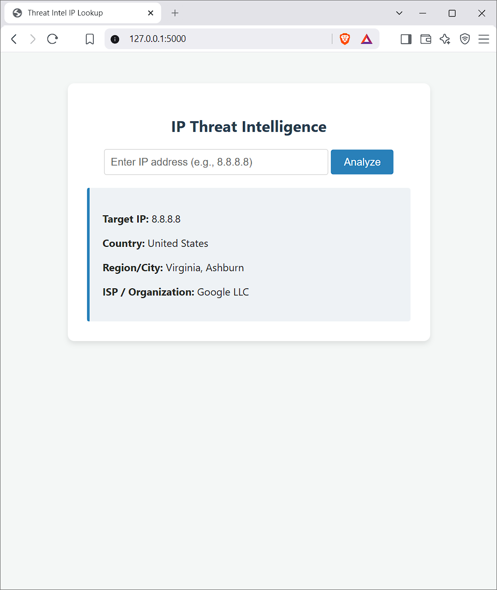

# Threat Intelligence IP Lookup Tool

A lightweight cybersecurity reconnaissance web utility built with Python and Flask. This tool enriches raw IP addresses by querying live threat intelligence and geolocation APIs to assist Security Operations Center (SOC) analysts in threat hunting, log analysis, and incident triage.

## Interface Preview

## Core Features

Real-time IP geolocation and network provider lookups. Clean, responsive web interface for quick threat investigation. Flask backend handling asynchronous API requests safely and efficiently.

## Tech Stack

Python 3.12, Flask Web Framework, Requests HTTP Library, IP-API Threat Intelligence Provider.

## Setup and Installation Instructions

To run this application locally, clone the repository to your machine by running `git clone https://github.com/6AnDI/ThreatIntel-Tool.git` in your terminal. Navigate directly into the project folder using `cd ThreatIntel-Tool`. Install the required Python dependencies by executing `pip install Flask requests`. Start the local web server by running `python app.py`. Open your web browser and navigate to `http://127.0.0.1:5000` to interact with the interface.
